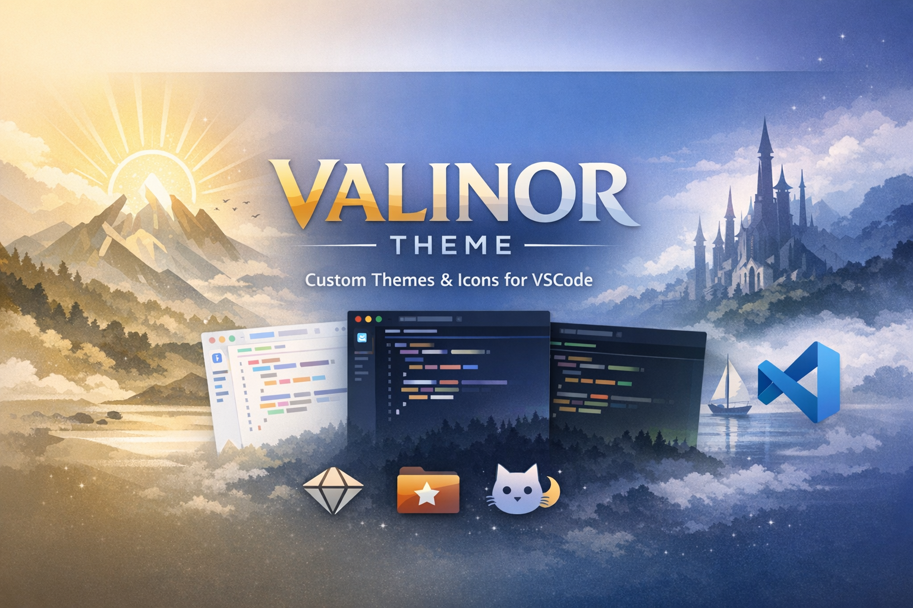

# Valinor VSCode Theme

## Descrição

Valinor theme é uma fusão de diversos temas já consolidados, todos inspirados no universo de Tolkien.

## Índice

- [Desenvolvimento](#desenvolvimento)
- [Como usar](#como-usar)
- [Configurações](#configurações)
- [Créditos](#créditos)
- [Licença](#licença)
- [Autores](#autores)

---

## Desenvolvimento

### Pré-requisitos

- Docker
- Make
- Git (com suporte a submodules)

### Instruções de instalação

1. Clone o repositório com os submodules:

```bash
git clone --recurse-submodules git@github.com:Diego-Brocanelli/valinor-theme.git && \
cd valinor-theme
```

> Caso tenha clonado sem `--recurse-submodules`, inicialize os submodules manualmente:

```bash
make init
```

2. Construa o container Docker:

```bash
make build
```

3. Acesse o shell dentro do container:

```bash
make sh
```

> Dentro do container, os arquivos de tema estão localizados no diretório `src`.

4. Gere os arquivos JSON do tema:

```bash
npm run build
```

> Os arquivos serão gerados no diretório `themes`.

### Atualizar ícones

Para atualizar os pacotes de ícones (Zed, Symbols) para a versão mais recente:

```bash
make update-icons
```

> O Catppuccin deve ser atualizado manualmente copiando os `theme.json` gerados pela extensão.

---

## Como usar

### VSCode

Abra o gerenciador de extensões:

```
Ctrl+Shift+X   # Windows / Linux
Cmd+Shift+X    # macOS
```

Pesquise por **valinor-theme** e clique em **Instalar**.

### Terminal

```bash
ext install DiegoBrocanelli.valinor-theme
```

---

## Configurações

### Ícones de arquivo

Pressione `Ctrl+Shift+P` (Windows/Linux) ou `Cmd+Shift+P` (macOS), digite `File Icon Theme` e selecione uma das opções:

- **Valinor Icons Zed** — ícones minimalistas do editor Zed
- **Valinor Icons Symbols** — ícones geométricos ultra-limpos (Miguel Solorio)
- **Valinor Icons Mocha** — Catppuccin Mocha
- **Valinor Icons Latte** — Catppuccin Latte
- **Valinor Icons Frappé** — Catppuccin Frappé
- **Valinor Icons Macchiato** — Catppuccin Macchiato

### Ícones de interface (UI)

Pressione `Ctrl+Shift+P` / `Cmd+Shift+P`, digite `Product Icon Theme` e selecione:

- **Valinor Product Icons Fluent** — ícones de UI do Fluent Design System (Microsoft)

### Fontes

Instale as fontes disponíveis em `fonts/`. Recomendada: `Zed Plex Mono`.

---

## Temas

### Light

#### Elbereth *(Catppuccin Latte)*

#### Fëanor *(Quiet Light)*


#### Galadriel *(Solarized Light)*


#### Galadriel (Omarchy) *(White)*

#### Gandalf *(Quiet Light variant)*


#### Glorfindel *(Better Solarized)*


#### Goldberry *(Flexoki Light)*

---

### Dark

#### Arien *(Kanagawa)*

#### Arwen *(Rosé Pine)*

#### Azaghâl *(Nord variant)*


#### Bombur *(Gruvbox)*

#### Celeborn *(Catppuccin Mocha)*

#### Celebrimbor *(Hackerman)*

#### Círdan *(Osaka Jade)*

#### Durin *(Nord)*


#### Eärendil *(Tokyo Night)*

#### Fangorn *(Everforest)*

#### Gimli *(Night Owl variant)*


#### Legolas *(Night Owl)*


#### Lúthien *(Ethereal)*

#### Morgoth *(Matte Black)*

#### Shelob *(Vantablack)*

#### Smaug *(Ristretto)*

#### Thranduil *(Nord)*

#### Ungoliant *(Miasma)*

---

## Créditos

### Temas

- [Better Solarized](https://marketplace.visualstudio.com/items?itemName=ginfuru.ginfuru-better-solarized-dark-theme)
- [Catppuccin](https://github.com/catppuccin/vscode)
- [Everforest](https://github.com/sainnhe/everforest)
- [Flexoki](https://github.com/kepano/flexoki)
- [Gruvbox](https://github.com/morhetz/gruvbox)
- [Kanagawa](https://github.com/rebelot/kanagawa.nvim)
- [Night Owl](https://marketplace.visualstudio.com/items?itemName=sdras.night-owl)
- [Nord](https://marketplace.visualstudio.com/items?itemName=arcticicestudio.nord-visual-studio-code)
- [Quiet Light for VSC](https://marketplace.visualstudio.com/items?itemName=onecrayon.theme-quietlight-vsc)
- [Rosé Pine](https://marketplace.visualstudio.com/items?itemName=mvllow.rose-pine)
- [Solarized](https://marketplace.visualstudio.com/items?itemName=ryanolsonx.solarized)
- [Tokyo Night](https://marketplace.visualstudio.com/items?itemName=enkia.tokyo-night)

### Ícones

- [Zed Icons](https://github.com/zed-industries/zed) — Zed Industries
- [Symbols](https://github.com/miguelsolorio/vscode-symbols) — Miguel Solorio
- [Fluent Icons](https://github.com/miguelsolorio/vscode-fluent-icons) — Miguel Solorio
- [Catppuccin Icons](https://github.com/catppuccin/vscode-icons) — Catppuccin

---

## Licença

Este projeto está licenciado sob a licença [MIT](https://github.com/Diego-Brocanelli/valinor-theme/blob/main/LICENSE).

## Autores

Diego Brocanelli — <diegod2@msn.com>