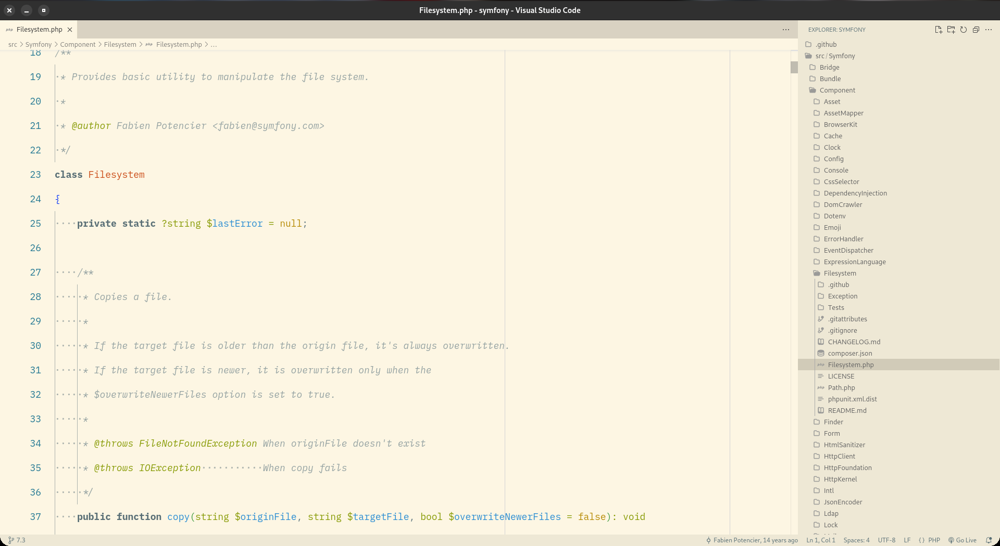

# Valinor VSCode Theme

## Descrição

Valinor theme é uma junção de deiversos temas já consolidados.

## Índice

- [Desenvolvimento](#desenvolvimento)
- [Como usar](#como-usar)
- [Configuracoes](#configurações)
- [Créditos](#créditos)
- [Licença](#licença)
- [Autores](#autores)

## Desenvolvimento

### Pré-requisitos

Para desenvolvimento, você precisará de:

- Docker;
- O pacote make.

### Instruções de Instalação

1. Clone o repositório do tema:

```bash
git clone https://github.com/seu-usuario/khazad-dump-theme.git && \
cd khazad-dump-theme
```

2. Construa o container Docker:

```bash
make build
```

3. Acesse o shell dentro do container:

```bash
make sh
```

> Dentro do container, os arquivos de tema estão localizados no diretório src.

4. Gere os arquivos JSON do tema:

```bash
npm run build
```

> Os arquivos serão gerados no diretório **themes**.

## Como usar

### VSCode

Abra o gerenciador de extensões com o atalho:

```bash
CTRL+SHFIT+X # windows ou Linux

Ou

CMD+SHIFT+X # mac
```

Pesquise por **valinor-theme** e clique em **Instalar**.

### Terminal

```bash
ext install DiegoBrocanelli.valinor-theme
```

# Configurações

## Ícones

Para definir os ícones, pressione `Cmd+Shift+P` (macOS) ou `Ctrl+Shift+P` (Windows/Linux), digite `File Icon Theme` e selecione a opção `Valinor Theme Icons`.

## Fonts

Instale as fontes que estão em `fonts`. Exemplo `Zed Plex Mono`.

## Opções

### Light

#### Fëanor


#### Galadriel



#### Gandalf


#### Glorfindel


### Dark

#### Azaghâl


#### Durin


#### Gimli


#### Legolas


## Créditos

Meus agradecimentos.

- [Night Owl](https://marketplace.visualstudio.com/items?itemName=sdras.night-owl)
- [Nord](https://marketplace.visualstudio.com/items?itemName=arcticicestudio.nord-visual-studio-code)
- [Quiet Light for VSC](https://marketplace.visualstudio.com/items?itemName=onecrayon.theme-quietlight-vsc)
- [Rosé Pine](https://marketplace.visualstudio.com/items?itemName=mvllow.rose-pine)
- [Solarized](https://marketplace.visualstudio.com/items?itemName=ryanolsonx.solarized)
- [Tokyo Night](https://marketplace.visualstudio.com/items?itemName=enkia.tokyo-night)
- [Zed Icons](https://github.com/zed-industries/zed)

## Licença

Este projeto está licenciado sob a licença [MIT](https://github.com/Diego-Brocanelli/khazad-dump-theme/blob/main/LICENSE). Consulte o arquivo LICENSE para mais informações.

## Autores

Diego Brocanelli <diegod2@msn.com>